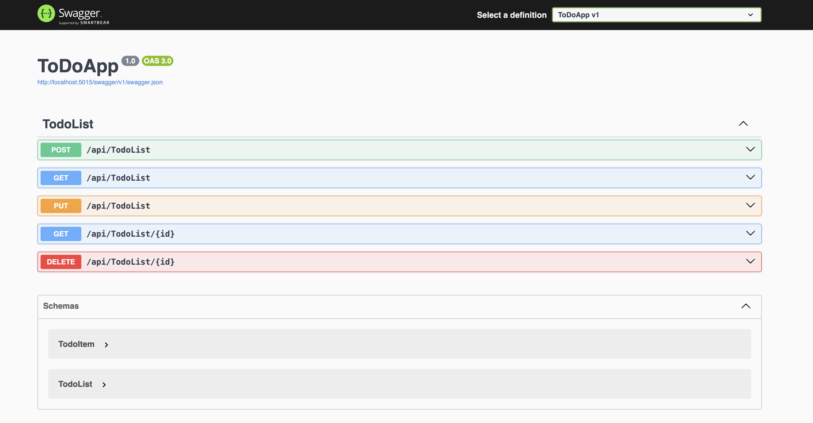
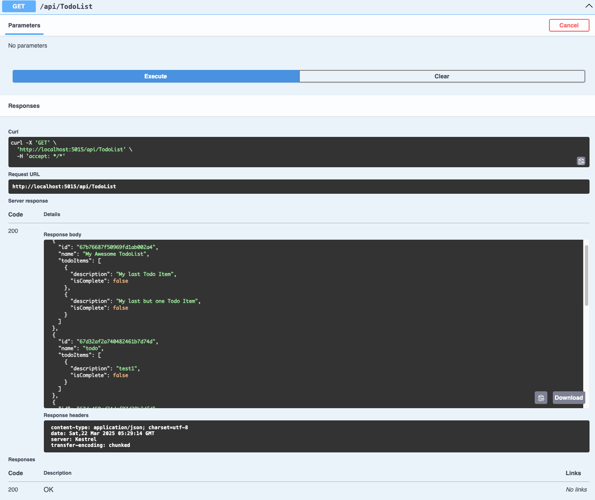

# ASP.NET Core WEB API - Restful CRUD ToDoList

This is a simple ASP.NET Core WEB API applicaiton built using .NET 9. The project demonstrates CRUD operations on TO Do List using inbuilt Swagger UI  and MongoDB as the Database.

## 🛠 Tech Stack

- **.NET SDK:** .NET 9
- **Framework:** ASP.NET Core Web API
- **ORM:** MongoDB .NET Driver
- **Database:** MongoDB
- **Views:** Swagger UI

---

## 📁 Project Structure
````
/ItemTracker
│
├── Controllers
│   └── ToDoListController.cs         # Handles routing and logic for todo list operations
│
├── Models
│   └── TodoItems.cs                    # List Item model definition
│   └── TodoList.cs                     # List model definition
│
├── Service
│   └── TodoListService.cs                    # List Item service logic
├── DatabaseSettings.cs                       # Database configuration settings 
│
├── appsettings.json               # DB configuration and app settings
├── Program.cs                     # Entry point of the application


````

## ⚙️ Installation and Setup

### 1. Install .NET 9 SDK

Make sure you have the latest .NET 9 SDK installed.

Download from: [https://dotnet.microsoft.com/en-us/download/dotnet/9.0](https://dotnet.microsoft.com/en-us/download/dotnet/9.0)

To verify installation:

```bash
dotnet --version
```
### 2. Add MongoDB .NET Drivers
```bash
MongoDB.Driver
MongoDB.Bson
```
### 3. Set Up MongoDB Server Using Docker
```bash
Docker compose up -d
```
### Overview of the Swagger UI 







